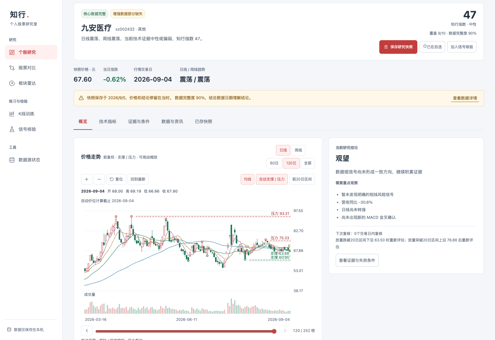
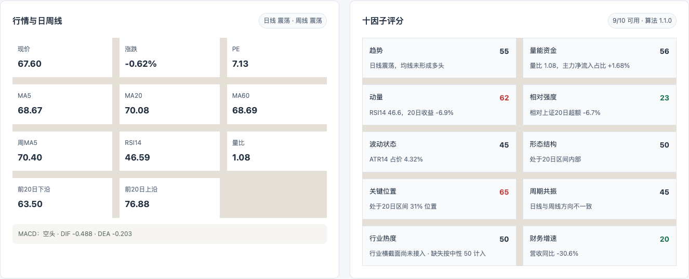
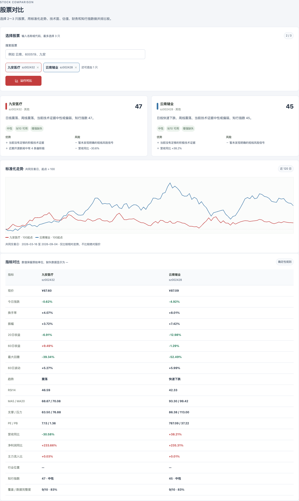
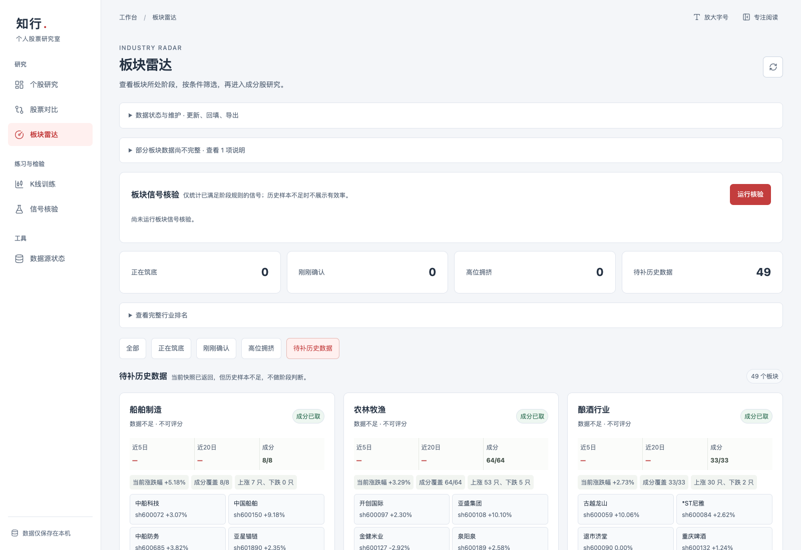
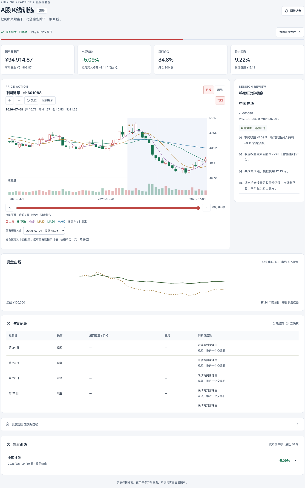

# 知行股研

知行股研是一个面向 A 股市场的研究工作台，将行情查看、技术分析、股票对比、行业观察和训练复盘整合在同一套流程中。研究结果保留评分依据、数据来源和历史快照，方便从一只股票的走势出发，逐步形成、记录并核对研究判断。

[产品界面](#产品界面) · [功能总览](#功能总览) · [本地运行](#本地运行) · [技术架构](#技术架构)

## 产品界面

以下截图来自 2026-09-05 的本地开发版本，价格、指标与数据状态以界面所示日期为准。点击图片可查看原图。

### 个股研究：把走势与研究结论放在一起

输入股票代码或名称，即可查看前复权 K 线、日周线趋势、知行指数与研究结论。图表支持拖动、缩放、逐根查看开高低收，叠加移动均线、成交量、支撑压力和历史评分；右侧同时列出需要观察的因素与复核条件。



图中展示九安医疗的研究快照，行情截止 2026-09-04。快照价格、数据完整度与保存时间同时可见，便于区分当时的研究记录与当前行情。研究结果可加入自选、保存快照或进入后续信号核验。

### 指标拆解：查看分数背后的条件

技术指标页汇总均线、RSI、MACD、量比和价格区间，并将十因子评分逐项展开。每个因子给出分数与触发原因，缺失数据也会保留说明，便于判断结果依赖了哪些信息。



### 股票对比：在一致的尺度上观察差异

同时选择 2–3 只股票，查看研究摘要、优势与风险，并在共同交易日上将价格归一化到起点 100。下方保留估值、财务、技术指标和数据完整度的原始数值，支持从趋势差异进一步追查具体原因。



### 板块雷达：把个股放回行业背景

板块雷达汇总行业表现、成分覆盖与阶段判断，支持查看行业详情、关注板块和核验阶段信号。横截面排名与历史确认状态分别展示，便于判断一个变化是否已有足够的数据支持。



当前截图中的板块已返回行情快照和成分信息，历史样本仍不足，因此页面保留“待补历史数据”的状态，暂不生成阶段评分。

### K 线训练：逐日推演，再回看决策

从主板参考池或自选中抽取真实历史片段，隐藏股票身份与后续走势，按交易日逐步进行模拟决策。训练支持 20、40、60 日推演，并在结束后展示资金曲线、基准表现、最大回撤、费用与逐笔记录。



图中为一局提前结束的历史训练复盘，保留了收益、回撤与基准差异等实际运行结果。模拟成交方式、费用和历史数据边界见 [K 线训练说明](docs/KLINE_TRAINING.md)。

## 功能总览

| 模块 | 主要能力 |
| --- | --- |
| 个股研究 | 全市场名称 / 代码搜索、自选管理、前复权 K 线、技术指标、多空证据、研究快照 |
| 规则评分 | 七维确定性评分、S/A/B/C 等级、触发原因、策略版本与规则指纹 |
| 参考池与扫描 | 可选 66 只 A 股与 11 只 ETF 参考池、批量行情扫描、候选筛选与轮动池 |
| 股票对比 | 2–3 只股票并行分析、归一化走势、估值与财务指标对照 |
| 板块雷达 | 行业快照、成分覆盖、阶段观察、行业关注与信号核验 |
| 信号核验 | 跟踪 1 / 5 / 20 个交易日后的表现，并在数据可用时计算相对沪深 300 的超额收益 |
| K 线训练 | 随机历史盲练、逐日模拟决策、训练恢复、结算复盘与历史记录 |
| 数据源状态 | 数据访问状态、长期数据湖覆盖、采集范围、历史回补、任务进度与错误信息 |

### 两种评分口径

**个股深研的知行指数**为 0–100 分，结合十因子评分、六维雷达和日周线状态呈现研究证据。

**策略规则分**由估值、价量、板块、资金、趋势、风险和扣非质量七个维度累加，输出 S/A/B/C 等级。默认阈值为 S ≥ 22、A ≥ 14、B ≥ 5，其余为 C；同时保留过滤原因、策略版本与规则指纹。两套分数分别计算，用于呈现不同分析口径。

### 研究记录与数据管理

自选列表、行情缓存、扫描记录、研究快照和训练记录由 SQLite 持久化。研究快照按股票归并，手动保存后进入时间线，并按交易日与结论指纹去重。

可选 CNEquity 后端将原始日线、复权因子、财报、公告索引和行业成员历史保存在本机 Parquet 数据湖。个股研究、扫描、行业成分计算和训练优先复用已覆盖的历史；盘中行情继续实时请求，未覆盖的日线自动使用备用接口。采集入口位于“数据源状态”，详见[本地数据湖说明](docs/DATA_LAKE.md)。

日线统一校验复权口径、日期与价量关系，深研按交易日历核对数据日期。行业历史显示真实覆盖率与当前成分回推的限制，补采结果和后台重试状态保存在本地。

数据适配器对来源、抓取时间、字段缺失和降级原因分别记录。增强数据不可用时，界面保留核心研究结果并提示缺失状态；适配器可按配置重试、切换备用源或使用最近成功的缓存。

## 本地运行

需要 Python 3.11+ 和 Node.js 22.13+。初始化脚本默认使用 `python3.12`。

```bash
git clone https://github.com/rheeh/ttt.git
cd ttt
./scripts/bootstrap.sh
./scripts/dev.sh
```

如需指定 Python：

```bash
PYTHON_BIN=python3.11 ./scripts/bootstrap.sh
```

启动后打开：

- 研究工作台：[http://127.0.0.1:5173](http://127.0.0.1:5173)
- API 文档：[http://127.0.0.1:8765/docs](http://127.0.0.1:8765/docs)

可选安装 AKShare 备用源：

```bash
.venv/bin/python -m pip install -r requirements-optional.txt
```

启用长期数据采集后端：

```bash
.venv/bin/python -m pip install -r requirements-data.txt
```

启动应用后，在“数据源状态 → 长期历史数据湖”设置股票范围并点击“回补最近3年”。默认仅采集5只示例股票；财报、公告与行业成员通过单独按钮启动。首次手动采集后，应用运行期间可自动更新。未安装此依赖时仍可使用原有在线行情功能。

运行验证：

```bash
./scripts/verify.sh
```

## 技术架构

| 层级 | 技术与职责 |
| --- | --- |
| 前端 | React 19、TypeScript、Vite；研究工作台、交互图表与页面状态管理 |
| API | FastAPI、Pydantic；分析、候选管理、数据状态与训练接口 |
| 分析引擎 | Python；规则评分、技术指标、研究诊断与表现核验 |
| 数据适配 | 腾讯实时行情、CNEquity 本地历史、腾讯日线及东方财富增强数据，可选 AKShare 备用源 |
| 存储 | SQLite 保存业务记录；可选 Parquet 数据湖保存长期行情、复权因子与研究数据 |
| 配置 | JSON 策略规范、股票 / ETF 参考池 |

```text
apps/desktop/                 React 研究工作台
services/desktop-api/app/      本地 API、行情适配与分析引擎
packages/strategy-spec/        策略配置与 JSON Schema
packages/stock-presets/        可选参考池
tests/                        后端与评分测试
scripts/                      初始化、启动与验证工具
docs/                         功能说明与数据边界
docs/images/                  产品运行截图
```

数据库默认保存在当前用户的本地应用数据目录，不随仓库提交；后端默认监听 `127.0.0.1`。

## 进一步了解

- [实现说明](docs/IMPLEMENTATION.md)
- [数据来源与限制](docs/DATA_SOURCES.md)
- [本地数据湖：采集、更新与备份](docs/DATA_LAKE.md)
- [K 线训练规则与接口](docs/KLINE_TRAINING.md)
- [第三方声明](THIRD_PARTY_NOTICES.md)
